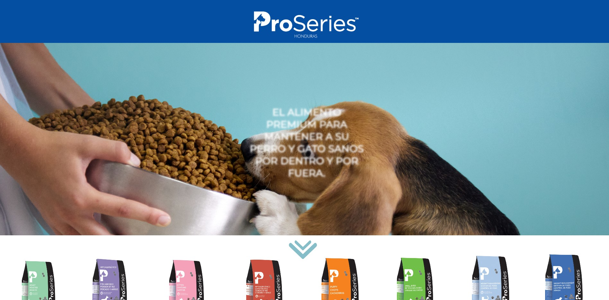

# ProSeries Honduras

Official **ProSeries** website for Honduras and Central America.

### Description

ProSeries is a grain-inclusive dry dog food using a significant amount of named meat meals as its dominant source of animal protein, thus receiving 5 stars. This website was made to represent the befefits of ProSeries to new markets.

ProSeries was introduced to CA with Distribuidora REALVA Honduras, known for the amazingly results of the ingredients. ProSeries is freshly made in Canada to keep your dog and cat healthy inside and out. We believe in science-based nutrition, without compromise.

Each ProSeries kibble is infused with maximum nutrition using high-quality and carefully tested ingredients, which are locally-sourced whenever possible. From our kitchen to yours, we make pet food you can trust.

CoreyTec™ puts the full power of science into every pet formula we produce. Raising the bar beyond typical pet food formulation techniques, we’ve developed a series of production innovations that guarantee a finer, fresher, nutritionally dense food for the pets we love. Our commitment is to the highest quality standards, without compromise. When innovation meets nutrition, the result is healthy pets and happy families.

We grind ingredients in a specialized hammermill rotating at high speeds, producing a consistency similar to flour. Fine Grind provides denser pellets, less bag dust, better oral health, and more nutrients going in your pet than coming out.

During this process, air is removed completely from the production chamber, forcing nutrient-rich oils to permeate the kibble without making it greasy. Unlike in standard pet food production, nutrients stay deep within the kibble, creating a clean, dry, nutritious food with a high level of healthy fats.

In combination with special packaging that protects food from air and light, our unique Freshness Valve keeps oxygen out and food fresh. Pet food protected from oxidization delivers healthy fats and vitamins with more potency and flavour, and last longer in your home.

### Technologies

The following technologies were used for the development of the template:

- HTML
- CSS
- JavaScript

### Design

![Products]img/ProductsPage.jpg)
![Products]img/CatProducts.jpg)
![Products]img/Ingredients.jpg)

Developed by @github/eduardodavidmm
